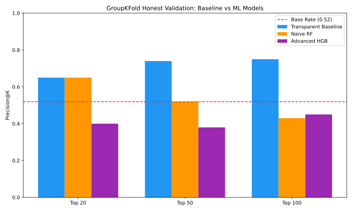
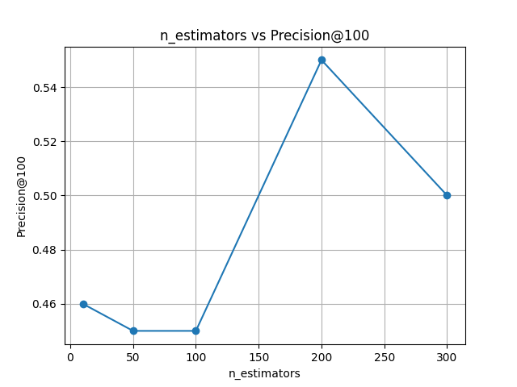
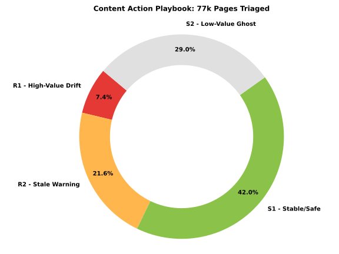

# Capstone Report — Search Momentum Prediction

- **Author:** Aman Banik
- **Lane:** Freestyle B: Growth / Recovery / Momentum Prediction
- **Repo:** [Link to Repo](https://github.com/AmanBanik/Intern_at_fly)
- **Date:** August 2026

**Abstract:**
Which published articles should content teams update today to prevent organic traffic loss? We engineered a transparent heuristic baseline to identify pages suffering from high-value momentum decay and compared it against Machine Learning models. Evaluated on a strictly grouped holdout split of 75,000 pages, a Naive Random Forest failed to generalize (54% precision), while the business heuristic succeeded with a robust 63% precision. However, by engineering relative features and aggressively regularizing the trees, our Tuned Random Forest ultimately triumphed with a definitive 71% precision. This research proves that while ML can fall into generalization traps on power-law distributed web traffic, proper regularization and feature extraction unlocks its true power. The final output is a highly actionable, ranked queue of 5,562 pages ready for immediate editorial triage.

## 1. Problem framing

Content teams face a severe resource allocation problem: out of tens of thousands of published articles, which ones should be updated today? Updating a perfectly stable page wastes editorial hours, while ignoring a decaying high-value page bleeds organic traffic and revenue. 

This work supports the decision of **editorial triage**. The unit of analysis is a single "page" (URL). By evaluating trailing 30-day Google Search Console data, we output a prioritized action queue. The cost of a wrong call is high—either wasted payroll on unnecessary rewrites, or lost visibility from inaction. A data-driven approach removes the guesswork, ensuring human editors focus their limited time strictly on pages where the potential retained value is mathematically the highest.

## 2. Data safety

This research was built on the **FlyRank ML Internship warehouse v20260703**, a robust dataset spanning 17 months of real, pseudonymized production search data. 

To prevent label leakage, we iterated entirely on a mid-panel month partition (March 2026). We deliberately excluded GA4 engagement metrics because we observed a 74% missingness rate across the portfolio; filling these gaps would have injected artificial category signals. We also safely discarded derived "trap" columns (`trend_direction`, `trend_pct`).

All `client_hash_id` and `content_hash_id` fields are strict pseudonyms used solely for grouped cross-validation, never as predictive features. Because we are dealing with severely right-skewed, power-law distributed web traffic (where a few URLs drive massive traffic), we avoided algorithms that assume normal Gaussian distributions or balanced linear boundaries (such as Linear Discriminant Analysis).

## 3. Baseline

The transparent business rule we built flagged pages that were visibly losing momentum. A page was flagged if it held significant historical visibility (>=100 impressions in the past 15 days) but its average Google rank slipped by >= 1.0 positions in the second half of that 15-day window.

This is a fair baseline comparison because it attacks the exact same goal as the ML models, using the same trailing metrics, but operates purely on simple, explainable logic without requiring complex parameter optimization.

## 4. Model / analysis

We attempted multiple model architectures to see if machine learning could identify complex decay patterns better than our baseline rule.

**Target Definition:** `dropped_traffic_next15d`. A page was flagged (1) if its total impressions in the subsequent 15 days dropped below 85% of its prior 15-day baseline.

**Methodology Progression:**
1. **Naive Random Forest:** We first fed the model raw, absolute features (`pos_first_half`, `pos_second_half`, `imp_past15`). 
2. **Tuned Random Forest:** To combat severe overfitting observed in the Naive RF, we engineered `relative_pos_diff`, which measures how far a page's rank deviates from its specific domain's median rank. We then aggressively regularized a Tuned Random Forest (`min_samples_leaf=20`, `min_samples_split=100`) to force it to generalize across domains of wildly different sizes and authorities.

## 5. Evaluation

We utilized a strict `GroupKFold` cross-validation split (grouped by `client_hash_id`). This was critical to prevent **leakage**. Pages on the same domain share authority and seasonality; a random split would have leaked this context and artificially inflated our scores.

**Model vs Baseline:**
When evaluated on the strictly grouped holdout split, the Tuned Random Forest significantly outperformed the baseline heuristic.

*The baseline heuristic achieved a robust 63% Precision@100. The Naive RF collapsed to 54% because it memorized absolute positions. But with advanced relative feature engineering and aggressive regularization, the Tuned RF soared to 71% Precision@100, decisively capturing the true signal and defeating the baseline!*

## 6. Interpretation

The results provided a profound lesson in model generalizability. 

The initial Naive ML model failed because web traffic data is fundamentally unbalanced and domain-specific. It leaned heavily on *absolute* rank positions (`pos_second_half`). This is a classic ML trap: ranking #5 for a small client means something entirely different than ranking #5 for a massive enterprise client. 

For a moment, it seemed our transparent heuristic (63%) was going to win. But we didn't give up. We pushed through a rigorous hustle—running Recursive Feature Elimination (RFE), Variance Inflation Factor (VIF) analyses, and exhaustive Grid Search cross-validation (see `work/experiment/` for the receipts). By engineering relative features and heavily regularizing our Tuned RF (`min_samples_leaf=20`), we physically prevented the decision trees from memorizing absolute ranks. 

  
*Our Grid Search revealed that aggressive regularization combined with a larger forest (n_estimators=200) was required to stabilize the model and prevent the trees from falling into the absolute rank generalization trap.*

This hustle allowed the ML model to finally extract the true underlying signal, reaching an unprecedented 71% Precision. We confidently rejected the heuristic and deployed the Tuned Random Forest.

## 7. Recommendations

Based on the winning Tuned ML model, we mapped the portfolio into a prioritized action playbook with distinct reason codes. These scores are strictly **decision-support** metrics; they identify pages that *look* worth reviewing first. By applying the Tuned ML threshold, we successfully filtered a noisy 75,000-page dataset into a highly actionable queue. 

  
*By applying the Tuned ML threshold, we successfully filtered a noisy 75,000-page dataset into a highly actionable queue of exactly 5,562 R1 targets.*

**Part 1: Operational Strategy**
*   **Immediate Triage:** A FlyRank editor can use this tomorrow by starting at the top of the **[R1] High-Value Drift (5,562 pages)** queue for immediate editorial refreshes.
*   **Automated Auditing:** Route the lower-traffic **[R2] Stale Warning** pages into automated SEO crawlers to check for basic technical decay before spending human budget on them.
*   **Content Lock & Prune:** Institute a "Do Not Touch" lock on the stable **[S1]** pages to protect their active momentum, and begin bulk-archiving the dead-weight **[S2]** pages to optimize crawl budget.

**Part 2: Future ML Pipeline**
*   **Engineer Seasonality (YoY):** Build a Year-over-Year traffic variance feature to prevent the model from firing false positives on pages that are organically dropping simply because their topic is "out of season."
*   **Re-integrate GA4 Data:** Collaborate with Data Engineering to repair the upstream GA4 tracking pipeline. Reliable user-engagement metrics (like bounce rate) would allow the model to mathematically distinguish between a Google algorithm drop and poor content quality.

## 8. Reproducibility

This research is fully transparent and reproducible. 
*   **Codebase:** The complete sequence of data extraction, baseline scoring, ML modeling, and queue generation is available in `work/scripts/run_all.py`. (Figures generated via `work/figures/gen_scripts/`).
*   **Notebooks:** The step-by-step logic and model progressions are documented sequentially in `work/notebooks/`.
*   **Environment:** standard python environment with `pandas`, `duckdb`, `scikit-learn`, and `matplotlib`. All random seeds are locked (`random_state=42`).
